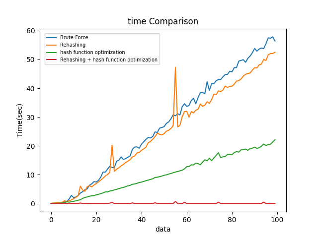
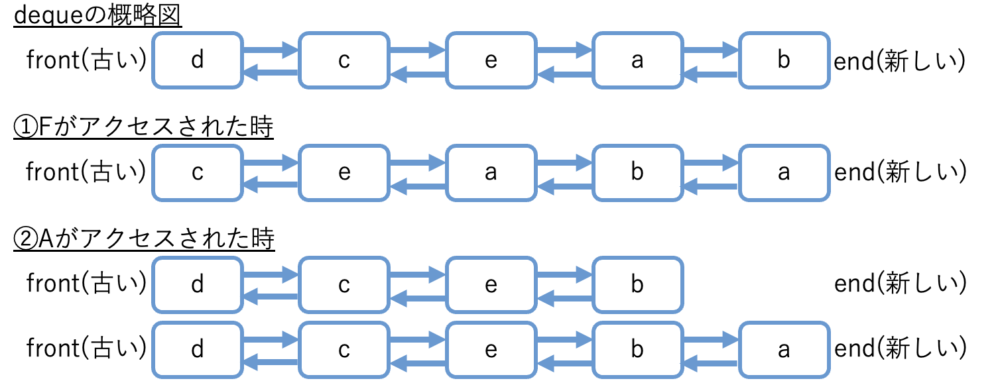

# Design Document
## <u>宿題１:ハッシュテーブルの実装</u>
### 概要
pythonのライブラリを使用せずにhash tableの実装を行う

### 実装・考え方
- delete関数を定義し、計算量がO(N)ではあるが動作するアルゴリズムを作成(hash_table.py)
  1. hash値を計算し、indexを計算
  2. itemに先頭の要素を格納、prev_itemにひとつ前の要素を格納する(最初はNone)
  3. 先頭の要素が削除したいものであれば、self.buckets[bucket_index]をitem.nextに更新することで実質削除したことになる<br>
  もし先頭以外の要素を削除したいのであれば、prev_item.nextをitem.nextに更新することで削除できる
    
- 計算量を減らすために以下のことを考える
1. 再ハッシュ化の導入(rehash.py)
    - 講義スライドで紹介されている下記のことを考える
      - 要素数がテーブルサイズの70%を上回ったら、テーブルサイズを2倍に拡張
      - 要素数がテーブルサイズの30%を下回ったら、テーブルサイズを半分に縮小
    - 
2. ハッシュ関数の変更(hashfun.py)
    - 多項式ハッシュを考える
      ```
      def calculate_hash(key: str) -> int:
        assert type(key) == str
        p = 31
        m = 10**9 + 9
        hash_value = 0
        p_pow = 1
        for i in key:
            hash_value = (hash_value + (ord(i) - ord('a') + 1) * p_pow) % m
            p_pow = (p_pow * p) % m
        return hash_value
      ```

### 結果・考察
- 下記の4つ条件において実装を行いかかる時間について比較した
  - 提供されたコードにdelete機能のみを追加したもの(Brute-Force)
  - 再ハッシュ化を実装したもの(Rehasing)
  - ハッシュ関数を多項式ハッシュに変更したもの(hash function optimization)
  - 再ハッシュ化とハッシュ関数の変更の両方を行ったもの(Rehasing + hash function optimization)
- 図からハッシュ関数の変更によってかなり時間が短くなっている
  - Brute-Force > Rehasing > hash function optimization > Rehasing + hash function optimization
- ハッシュの衝突に対応できる策を考えるよりそもそも衝突を防ぐことが最善 -> ハッシュ関数の設計が大切
- Rehasingにおいて急にかかる時間が跳ね上がる時がああるが、何度か実行してもその傾向は確認できた
  - 元々のord()を使用したハッシュ関数において再ハッシュ化のみを考えると衝突が多くてこのようの結果になるのではないか(衝突が多いと再ハッシュ化での処理が多くなるため)

<p align="center">
   
  <h3 style="text-align:center;">図1 比較実装結果</h3> 
</p>


## <u>宿題２：木構造とハッシュテーブルの比較</u>
### 問題
木構造を使えばO(log N)、ハッシュテーブルを使えばほぼO(1)で検索・追加・削除を実現することができて、これだけ見ればハッシュテーブルのほうが優れているように見える。ところが現実の大規模なデータベースでは、ハッシュテーブルではなく木構造が使われることが多い。その理由を考えよ。
### 解答
- 大規模なデータベースではhash tableを用いると衝突が頻発するかサイズを大きくしなければならず、それだと不安定になってしまう。一方で木構造であれば計算量はO(log N)であるが安定して構造を保つことが可能
- 実際の開発などではデータの順序に着目することもあ離、hash tableは順序を考慮していない構造であり、木構造は順序づけを考慮できるため。

## <u>宿題３：キャッシュ管理方法</u>
### 問題
キャッシュの管理をほぼO(1)で実現できるデータ構造を考えよ。
### 解答
- hashtable + queueを用いる
  1. hashを使用してURLとwebページの情報を管理するためのhash tableを作成
  2. データの順序を記録するためにdequeを作成(双方向に繋がりを持つことで古い要素の削除と新しい要素の追加を実現)
  3. 1と2を組み合わせてキャッシュを実現
- 表1の例から図2のような構造を考える
  - キャッシュに含まれない要素がアクセスされたら、一番古い要素を捨て、新しい要素として追加
  - キャッシュに含まれる要素がアクセスされたら、まず元々含まれている要素をhash tableのdeleteと同じアルゴリズムで削除し、新しい要素として再度追加する


<h3 style="text-align:center;">表1 キャッシュの例</h3>
<p align="center">
  <table>
    <thead>
      <tr>
        <th>URL</th>
        <th>Web page</th>
      </tr>
    </thead>
    <tbody>
      <tr>
        <td>b.com</td>
        <td>ページB</td>
      </tr>
      <tr>
        <td>a.com</td>
        <td>ページA</td>
      </tr>
      <tr>
        <td>e.com</td>
        <td>ページE</td>
      </tr>
      <tr>
        <td>c.com</td>
        <td>ページC</td>
      </tr>
      <tr>
        <td>d.com</td>
        <td>ページD</td>
      </tr>
    </tbody>
  </table>
</p>


<p align="center">
    
  <h3 style="text-align:center;">図2 キャッシュ管理の概略図</h3>
</p>


## <u>宿題4:キャッシュの実装</u>
### 概要　
宿題３の実装


