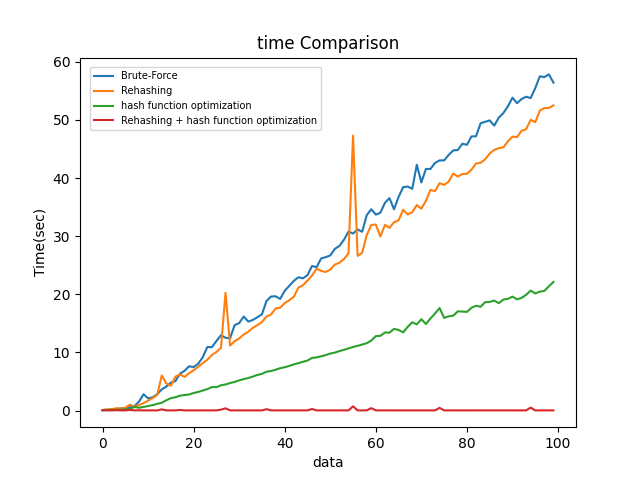

# Design Document
## <u>宿題１:ハッシュテーブルの実装</u>
### 概要
pythonのライブラリを使用せずにhash tableの実装を行う

### 実装
- delete関数を定義し、計算量がO(N)ではあるが動作するアルゴリズムを作成(hash_table.py)
  - 削除したいものを見つけたら要素が先頭か否かを調査する必要がある(図を入れたい)
    
- 計算量を減らすために以下のことを考える
1. 再ハッシュ化の導入
    - 要素数がテーブルサイズの70%を上回ったら、テーブルサイズを2倍に拡張
    - 要素数がテーブルサイズの30%を下回ったら、テーブルサイズを半分に縮小
2. ハッシュ関数の変更
    - hash関数の改良（素数の積で考える）
      - 素数のリストを各アルファベットに振ってその積で考えるとかなり遅い
      - ハッシュ値の衝突は起きにくいがそもそも計算量がかなり多い
      - 計算量が少ないかつ衝突が起きにくい関数を考える必要がある
      ```
      def calculate_hash(key: str) -> int:
          assert type(key) == str
          HASH = [2, 3, 5, 7, 11, 13, 17, 19, 23, 29, 31, 37, 41, 43, 47, 53, 59, 61, 67, 71, 73, 79, 83, 89, 97, 101]
          hash = 1
          for i in key:
              if ord(i) - ord('a') >= 0 and ord(i) - ord('a') < len(HASH):
                  hash *= HASH[ord(i) - ord('a')]
          return hash
      ```
    - 多項式ハッシュを考える
      ```
      def calculate_hash(key: str) -> int:
        assert type(key) == str
        p = 31
        m = 10**9 + 9
        hash_value = 0
        p_pow = 1
        for i in key:
            hash_value = (hash_value + (ord(i) - ord('a') + 1) * p_pow) % m
            p_pow = (p_pow * p) % m
        return hash_value
      ```

### 結果・考察
- 下記の4つ条件において実装を行いかかる時間について比較した
  - 提供されたコードにdelete機能のみを追加したもの(Brute-Force)
  - 再ハッシュ化を実装したもの(Rehasing)
  - ハッシュ関数を多項式ハッシュに変更したもの(hash function optimization)
  - 再ハッシュ化とハッシュ関数の変更の両方を行ったもの(Rehasing + hash function optimization)
- 図からハッシュ関数の変更によってかなり時間が短くなっている
  - Brute-Force > Rehasing > hash function optimization > Rehasing + hash function optimization
- ハッシュの衝突に対応できる策を考えるよりそもそも衝突を防ぐことが最善 -> ハッシュ関数の設計が大切
- Rehasingにおいて急にかかる時間が跳ね上がる時がああるが、何度か実行してもその傾向は確認できた
  - 元々のord()を使用したハッシュ関数において再ハッシュ化のみを考えると衝突が多くてこのようの結果になるのではないか(衝突が多いと再ハッシュ化での処理が多くなるため)

<p align="center">
    
</p>


## <u>宿題２：木構造とハッシュテーブルの比較</u>
### 問題
木構造を使えばO(log N)、ハッシュテーブルを使えばほぼO(1)で検索・追加・削除を実現することができて、これだけ見ればハッシュテーブルのほうが優れているように見える。ところが現実の大規模なデータベースでは、ハッシュテーブルではなく木構造が使われることが多い。その理由を考えよ。
### 解答
- 大規模なデータベースではhashを用いると衝突が頻発するかサイズを大きくしなければならず、それだと不安定になってしまう。一方で木構造であれば計算量はO(log N)であるが安定して構造を保つことが可能
- 

## <u>宿題３：キャッシュ管理方法</u>
### 問題
キャッシュの管理をほぼO(1)で実現できるデータ構造を考えよ。
### 解答
- hashtable + queueを用いる
- 下記のような構造を考える(図を入れたい)
  - キャッシュする長さを決めておく
  - 存在するkeyだったらそれを消して新たに追加
  - 存在しなかったら一番古いものを消して新たに追加


## <u>宿題4:キャッシュの実装</u>
### 概要
宿題３の実装


